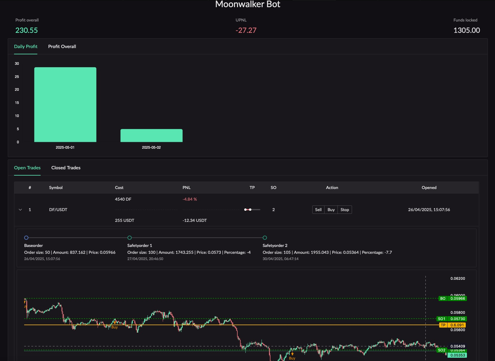

# moonwalker-ui



This steps should help get you started developing with Vue 3 in Vite.

## Project Setup

```sh
npm install
```

### Compile and Hot-Reload for Development

```sh
npm run dev
```

### Type-Check, Compile and Minify for Production

```sh
npm run build
```

### Lightweight Chart Usage by Tradingview

TradingView Lightweight Charts™
Copyright (с) 2024 TradingView, Inc. https://www.tradingview.com/